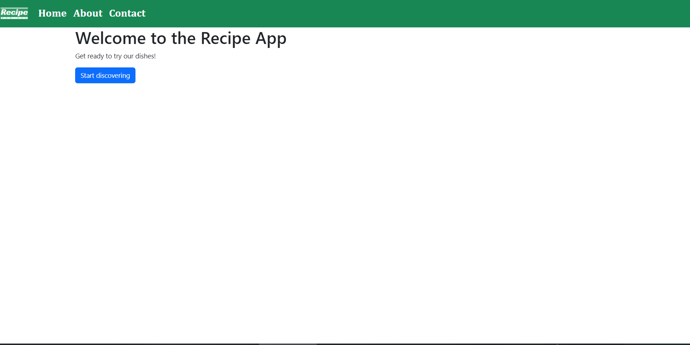

# Recipe App

This is a recipe app built with Angular. It allows users to browse and discover various recipes.

## Features

- View a list of recipes
- Click on a recipe to view its details
- Display recipe information such as description and votes
- Search for recipes by filtering options

## Technologies Used

- Angular
- TypeScript
- HTML
- CSS/SASS
- Bootstrap
- HttpClient

## Getting Started

1. Clone the repository: `git clone https://github.com/your-username/recipe-app.git`
2. Install dependencies: `npm install`
3. Start the development server: `ng serve`
4. Open your browser and visit: `http://localhost:4200`

## Screenshots

## License

This project is licensed under the MIT License. See the [LICENSE](LICENSE) file for more information.
